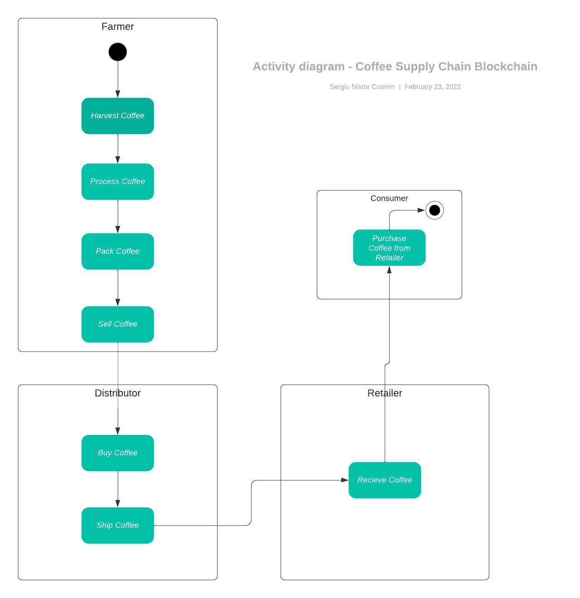
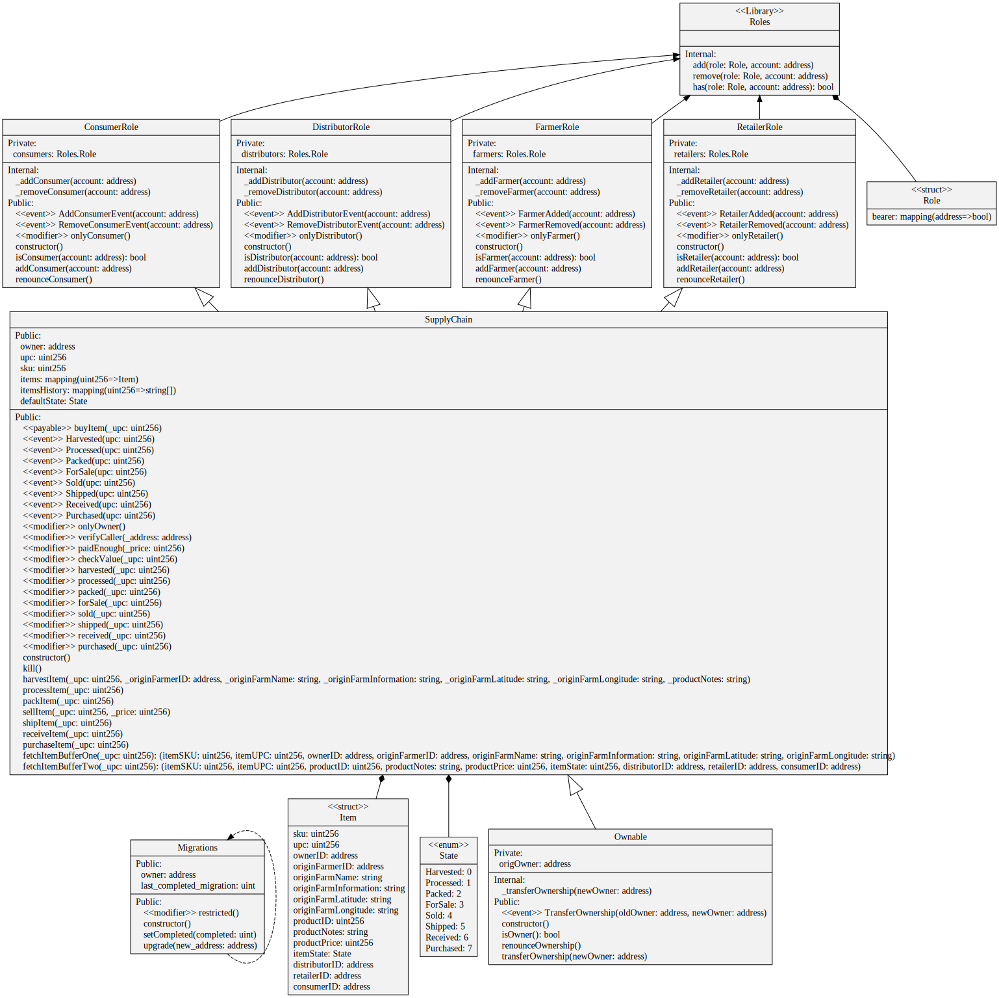
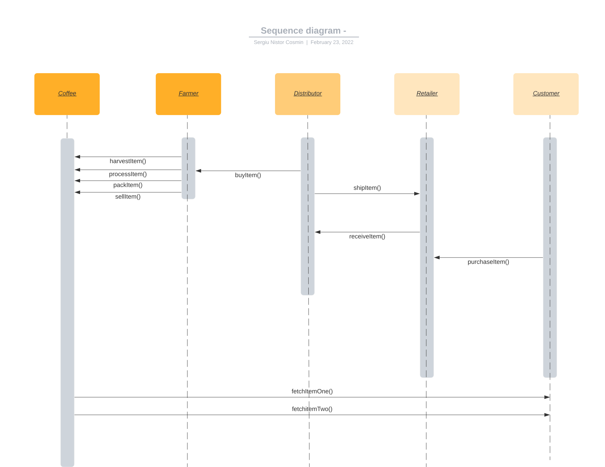
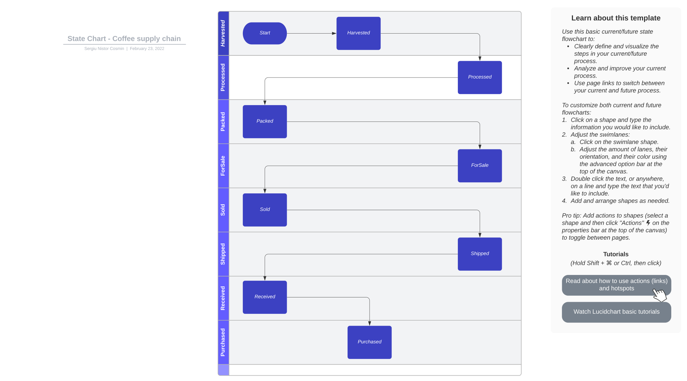

# Coffee Supply Chain - Blockchain Development

This repository containts an Ethereum DApp that demonstrates a Supply Chain flow between a Seller and Buyer. The user story is similar to any commonly used supply chain process. A Seller can add items to the inventory system stored in the blockchain. A Buyer can purchase such items from the inventory system. Additionally a Seller can mark an item as Shipped, and similarly a Buyer can mark an item as Received.

I've wrote 11 tests including role asigning to test the entire flow of the application using **Mocha** and **Chai**.

I've also included 4 UML diagrams for clarity:

Activity Diagram



Classes Diagram



Sequence Diagram



State Diagram




The DApp User Interface when running should look like...


## Getting Started

These instructions will get you a copy of the project up and running on your local machine for development and testing purposes. See deployment for notes on how to deploy the project on a live system.

### Prerequisites

Please make sure you've already installed ganache-cli, Truffle and enabled MetaMask extension in your browser.

```
Truffle v4.1.14 (core: 4.1.14)
Solidity v0.4.24 (solc-js)
Node v16.14.0
Npm 8.3.1
```

### Installing

> The starter code was written for **Solidity v0.4.24**.

A step by step series of examples that tell you have to get a development env running

Clone this repository:

```
git clone https://github.com/nistorsergiu2112/coffee-supply-chain-udacity-5
```

Install all requisite npm packages (as listed in ```package.json```):

```
npm install
```

Launch Ganache:

```
ganache-cli -m "spirit supply whale amount human item harsh scare congress discover talent hamster"
truffle compile
truffle migrate
truffle test
npm run dev
```

## Built With

* [Ethereum](https://www.ethereum.org/) - Ethereum is a decentralized platform that runs smart contracts
* [IPFS](https://ipfs.io/) - IPFS is the Distributed Web | A peer-to-peer hypermedia protocol
to make the web faster, safer, and more open.
* [Truffle Framework](http://truffleframework.com/) - Truffle is the most popular development framework for Ethereum with a mission to make your life a whole lot easier.
* [Ganache](https://trufflesuite.com/ganache/index.html) - Ganache is a personal blockchain for rapid Ethereum and Corda distributed application development


## Authors

Sergiu Nistor Cosmin

Starter code from : See also the list of [contributors](https://github.com/your/project/contributors.md) who participated in this project.

## Acknowledgments

* Solidity
* Ganache-cli
* Truffle
* IPFS
